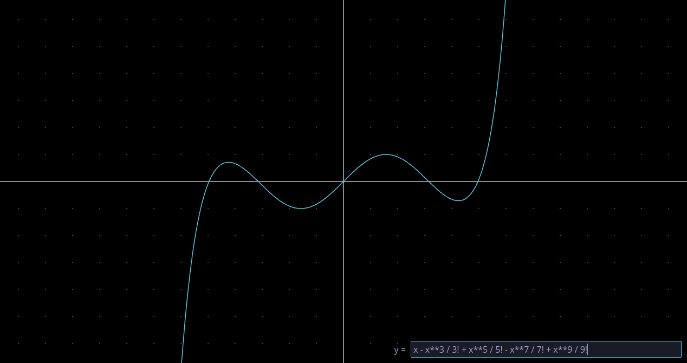

# Rust Scratch A Pixel

This is a project for learning CG in Rust, mostly inspired by [Scratchapixel][sap].

## Applications

To run an app:

```bash
just run <app>
```

### Plot



A utility to plot simple functions.

| Support expressions | |
|:-|:-|
| Number | `1`, `2.0`, ... |
| Factorial | `0!`, `10!`, ... |
| Variable | `x` |
| Constant | `e`, `pi` |
| Operator | `+`, `-`, `*`, `/`, `**` |
| Function | `sin`, `cos`, `sec`, `csc`, `tan`, `cot`, `arcsin`, `arccos`, `arctan`, `arccot`, `sqrt`, `log`, `ln` |

## References

- [PPM Format Specification](https://netpbm.sourceforge.net/doc/ppm.html)
- [BNF Notation: Dive Deeper Into Python's Grammar – Real Python](https://realpython.com/python-bnf-notation)
- [My First Language Frontend with LLVM Tutorial](https://llvm.org/docs/tutorial/MyFirstLanguageFrontend/index.html)

[sap]: https://www.scratchapixel.com
